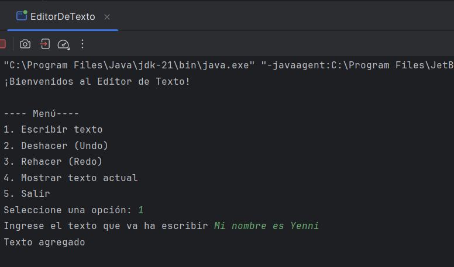
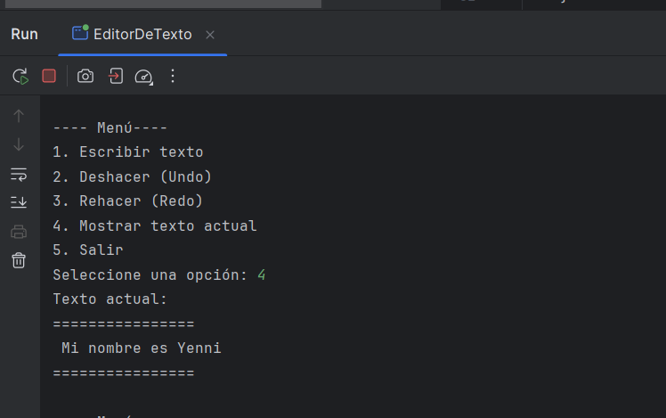
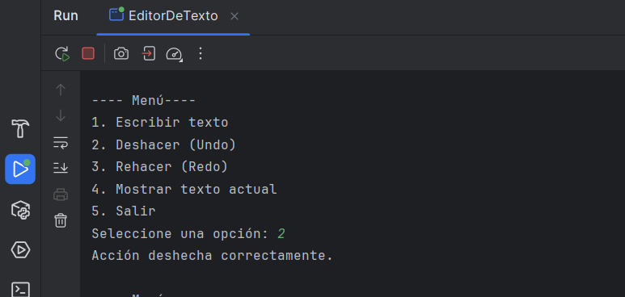
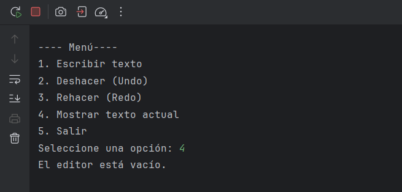
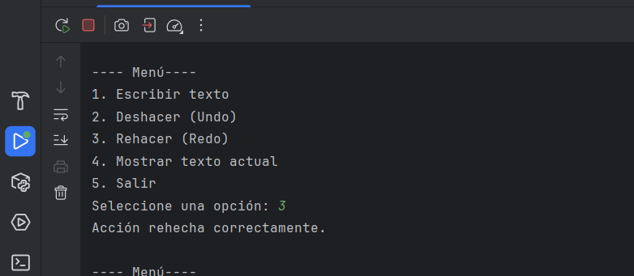
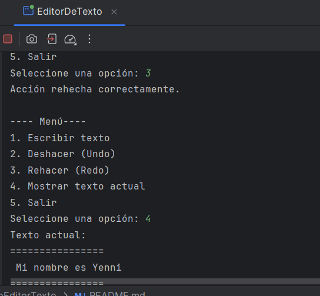

# Editor de Texto con Funcionalidad Undo/Redo

## ¿Qué es una Pila?
Una **pila** es una estructura de datos en la que los elementos se manejan bajo la regla **LIFO (Last In, First Out)**, es decir, el último en entrar es el primero en salir.  
Un ejemplo simple: si apilas platos en la mesa, el último que pongas será el primero que retires.

###  Operaciones Básicas de una Pila
- **`push()`** → Agregar un elemento en la parte superior.
- **`pop()`** → Retirar el elemento de la parte superior.
- **`peek()`** → Consultar el último elemento agregado sin eliminarlo.
- **`isEmpty()`** → Verificar si la pila está vacía.  


##  Cómo funcionan las Pilas en este Proyecto
El sistema utiliza **dos pilas** para gestionar los cambios del editor:

- **`pilaHistorial`** → Guarda los estados anteriores del texto al escribir.
- **`pilaRehacer`** → Conserva temporalmente los estados eliminados al deshacer, para poder recuperarlos después.

La dinámica funciona así:
1. Al **escribir texto**, el estado previo se almacena en `pilaHistorial`.
2. Si se ejecuta **Undo (Deshacer)**, el contenido actual pasa a `pilaRehacer` y se restaura el estado anterior desde `pilaHistorial`.
3. Con **Redo (Rehacer)**, se recupera desde `pilaRehacer` el último estado deshecho.

## Funcionalidades del Programa
El editor de texto incluye un menú con estas opciones:
1. Agregar texto.
2. Deshacer (Undo).
3. Rehacer (Redo).
4. Visualizar el texto actual.
5. Salir del programa.

## Ejemplo de Uso
El programa responde en consola de la siguiente forma:
El programa permite interactuar desde la consola. A continuación se muestran algunos ejemplos de ejecución:

### ➡️ 1. Escribir texto
Cuando el usuario selecciona la opción **1**, puede ingresar texto y este se almacena en el editor.



---

### ➡️ 2. Mostrar texto actual
Al elegir la opción **4**, se imprime en consola el contenido más reciente del editor.



---

### ➡️ 3. Deshacer (Undo)
La opción **2** revierte la última acción realizada, recuperando el estado anterior.





---

### ➡️ 4. Rehacer (Redo)
Con la opción **3**, se restaura un estado previamente deshecho.



---

## Cómo clonar y ejecutar el proyecto

1. Clonar este repositorio en tu computadora:
   ```bash
   git clone https://github.com/yennivanessa97/ProyectoEditorTexto.git

